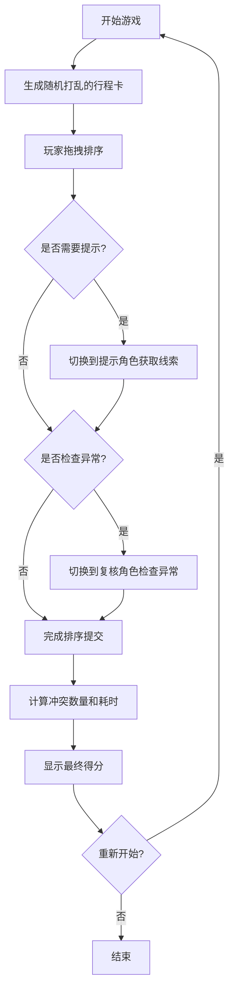

## 1. 产品概述

行程卡排序游戏是一款离线可玩的网页益智游戏，玩家需要将打乱的行程卡按照线路、站点、到达时段和优先级归入正确顺序。游戏支持多角色交互操作，通过拖拽排序、线索提示和异常检查等机制增加游戏趣味性。

### 1.1 目标用户
- 喜欢益智排序类游戏的玩家
- 需要训练逻辑思维能力的用户
- 喜欢挑战时间和准确率的游戏爱好者

### 1.2 产品价值
- 提供离线可玩的轻量级网页游戏体验
- 通过多角色交互机制增加游戏深度
- 训练玩家的逻辑排序和时间管理能力

## 2. 核心功能

### 2.1 用户角色

| 角色 | 核心操作 | 功能说明 |
|------|----------|----------|
| 玩家 | 拖动排序 | 通过拖拽将行程卡按正确顺序排列 |
| 提示角色 | 给出线索 | 提供关于正确排序的提示信息 |
| 复核角色 | 检查异常卡 | 识别并标记不符合规则的异常卡片 |

### 2.2 功能模块

1. **游戏主界面**：行程卡列表、拖拽排序区域、角色切换
2. **右键菜单**：标记待核对、锁定位置、查看提示、移到末尾
3. **计分系统**：根据冲突数量和耗时计算最终得分
4. **游戏状态**：会话内状态保存，支持重新开始

### 2.3 页面详情

| 页面名称 | 模块名称 | 功能描述 |
|-----------|-------------|---------------------|
| 游戏主页面 | 顶部状态栏 | 显示当前角色、游戏时间、冲突数量、得分 |
| 游戏主页面 | 行程卡列表 | 可拖拽排序的行程卡容器 |
| 游戏主页面 | 角色控制面板 | 切换不同操作角色 |
| 游戏主页面 | 右键操作菜单 | 卡片右键自定义操作菜单 |
| 游戏主页面 | 提示面板 | 显示提示角色给出的线索信息 |
| 游戏主页面 | 游戏结果弹窗 | 显示最终得分和排序正确性 |

## 3. 核心流程

### 3.1 游戏主流程

### 3.2 卡片操作流程
1. 玩家右键点击卡片弹出操作菜单
2. 选择操作：标记待核对/锁定位置/查看提示/移到末尾
3. 执行对应操作并更新卡片状态
4. 拖拽排序时忽略锁定位置的卡片

## 4. 用户界面设计

### 4.1 设计风格
- **主色调**：深蓝色系 (#1e3a5f) 作为主色，搭配琥珀色 (#f59e0b) 作为强调色
- **辅助色**：绿色 (#10b981) 表示正确，红色 (#ef4444) 表示错误/异常
- **背景**：深色渐变背景，营造沉浸感
- **卡片风格**：轻微阴影、圆角、边框线，悬停时上浮效果
- **字体**：使用现代无衬线字体，标题加粗，正文清晰易读
- **动效**：平滑的拖拽动画、卡片排序过渡、状态变化反馈

### 4.2 页面设计概述

| 页面名称 | 模块名称 | UI 元素 |
|-----------|-------------|-------------|
| 游戏主页面 | 顶部状态栏 | 深色背景、图标 + 文字信息、颜色编码状态指示 |
| 游戏主页面 | 行程卡列表 | 垂直列表布局、卡片间距适中、拖拽时高亮放置位置 |
| 游戏主页面 | 角色控制面板 | 三个角色按钮，当前选中高亮 |
| 游戏主页面 | 右键操作菜单 | 浮层菜单、图标 + 文字、悬停高亮 |
| 游戏主页面 | 提示面板 | 侧边滑出、半透明背景、提示信息逐条显示 |
| 游戏主页面 | 游戏结果弹窗 | 居中模态框、得分动画、重新开始按钮 |

### 4.3 响应式设计
- 桌面端优先设计
- 移动端适配：卡片宽度自适应，角色控制改为底部或顶部导航
- 触摸操作优化：增大拖拽热区，支持长按触发右键菜单

### 4.4 状态视觉设计
- **锁定卡片**：灰色半透明，带锁图标，不可拖拽
- **待核对卡片**：黄色边框，带问号图标
- **异常卡片**：红色边框，带感叹号图标
- **正确位置卡片**：绿色边框高亮
- **拖拽中卡片**：缩放 + 阴影增强效果
