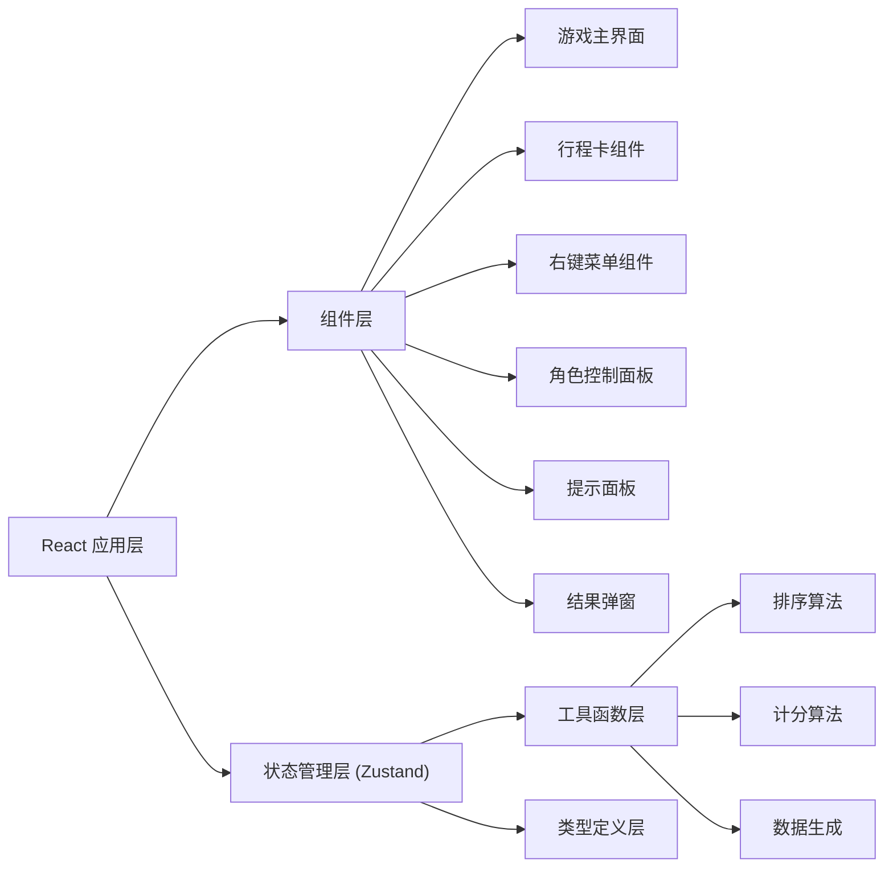

## 1. 架构设计



## 2. 技术描述

- **前端框架**：React@18 + TypeScript
- **构建工具**：Vite@5
- **样式方案**：Tailwind CSS@3
- **状态管理**：Zustand
- **拖拽库**：@dnd-kit/core + @dnd-kit/sortable（原生 HTML5 拖拽 API 备选）
- **图标库**：lucide-react
- **后端**：无（纯前端离线应用）
- **数据持久化**：sessionStorage（会话内状态保存）

### 2.1 技术选型说明
- 选择 @dnd-kit 实现拖拽排序，提供更好的触摸支持和动画效果
- 使用 Zustand 进行轻量级状态管理，避免 Redux 的复杂性
- Tailwind CSS 提供快速开发和一致的设计系统
- 纯前端实现，所有数据在客户端生成和处理，确保离线可玩

## 3. 路由定义

| 路由 | 用途 |
|-------|---------|
| / | 游戏主页面 |

## 4. 数据模型

### 4.1 核心类型定义

```typescript
// 行程卡类型
interface TripCard {
  id: string;
  line: string;        // 线路
  station: string;     // 站点
  timeSlot: string;    // 到达时段
  priority: number;    // 优先级 (1-5)
  correctOrder: number; // 正确顺序索引
  isLocked: boolean;   // 是否锁定
  isPending: boolean;  // 是否待核对
  isAnomaly: boolean;  // 是否异常卡
}

// 角色类型
type Role = 'player' | 'hint' | 'reviewer';

// 游戏状态
interface GameState {
  cards: TripCard[];
  currentRole: Role;
  startTime: number | null;
  elapsedTime: number;
  hints: string[];
  usedHints: number;
  isGameOver: boolean;
  score: number;
  conflictCount: number;
}
```

### 4.2 游戏数据生成规则
- 生成 8-12 张行程卡
- 每条线路包含 2-4 个站点
- 时段按时间顺序排列（早高峰、上午、中午、下午、晚高峰、夜间）
- 优先级 1-5，数字越大优先级越高
- 混入 1-2 张异常卡（数据不符合逻辑规则）

## 5. 核心算法

### 5.1 排序正确性检测
- 按线路分组检查
- 同一线路内按时段先后顺序检查
- 同一线路同一时段内按优先级检查
- 统计冲突数量

### 5.2 计分算法
- 基础分：1000 分
- 时间惩罚：每 10 秒扣 5 分
- 冲突惩罚：每个冲突扣 50 分
- 提示惩罚：每个提示扣 30 分
- 最低分：0 分

### 5.3 异常卡检测规则
- 时段逻辑冲突（如站点顺序与时段矛盾）
- 线路与站点不匹配
- 优先级异常（如夜间时段优先级过高）

## 6. 组件结构

```
src/
├── components/
│   ├── GameBoard.tsx        # 游戏主面板
│   ├── TripCard.tsx         # 行程卡组件
│   ├── CardList.tsx         # 卡片列表（拖拽容器）
│   ├── ContextMenu.tsx      # 右键菜单
│   ├── RolePanel.tsx        # 角色控制面板
│   ├── StatusBar.tsx        # 顶部状态栏
│   ├── HintPanel.tsx        # 提示面板
│   └── ResultModal.tsx      # 结果弹窗
├── hooks/
│   ├── useGame.ts           # 游戏逻辑 hook
│   └── useTimer.ts          # 计时器 hook
├── store/
│   └── gameStore.ts         # Zustand 状态管理
├── utils/
│   ├── cardGenerator.ts     # 卡片生成工具
│   ├── scoring.ts           # 计分算法
│   └── validation.ts        # 排序验证
├── types/
│   └── index.ts             # 类型定义
├── App.tsx
├── main.tsx
└── index.css
```
